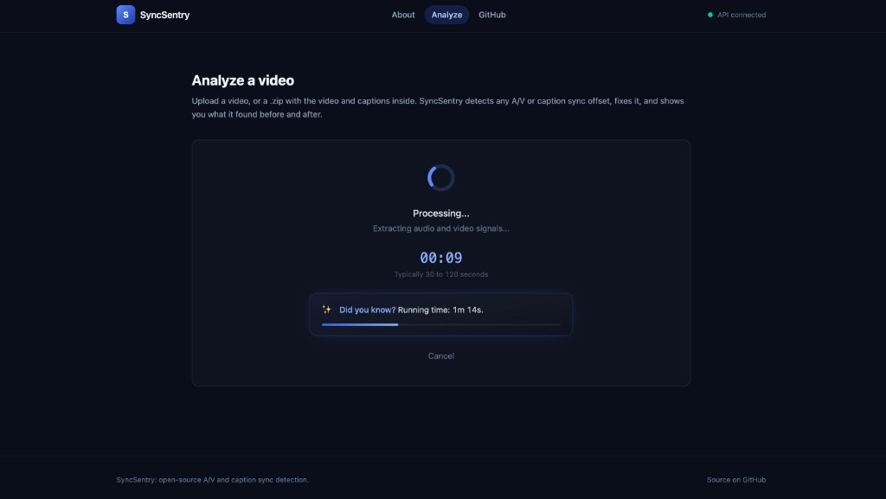
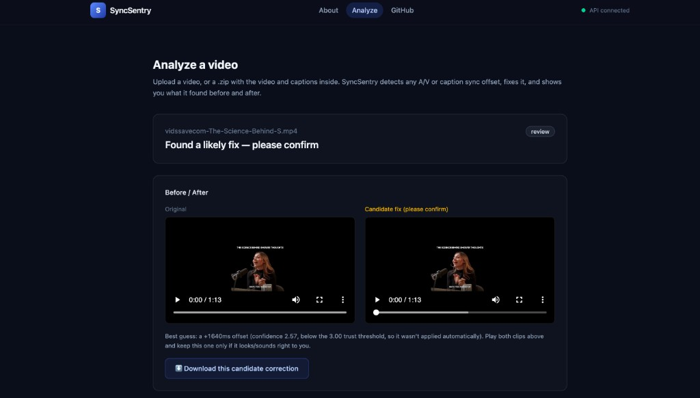

# SyncSentry

Detects and fixes audio/video sync drift in video files, using lip motion and speech, not captions or timestamps.

<table>
  <tr>
    <td></td>
    <td></td>
  </tr>
</table>

*While it's working (this takes a bit, sync detection isn't instant), it keeps you occupied with facts about your video instead of a bare spinner. When it's done, it shows you the before and after side by side, so you never have to just take its word for it.*

Most sync tools assume one global offset for the whole file. Real content does not always work that way: a compilation of clips can have a different offset in every clip, and some clips can drift over time instead of staying constant. SyncSentry treats this as the general case, not an edge case.

## How it works

- Watches for who's talking on screen and listens for when they're actually speaking.
- Works out how far the mouth movements and the voice are apart.
- Fixes it. If different parts of the video are off by different amounts, each part gets its own fix instead of one number forced on everything.
- Checks its own fix before calling anything "fixed." If it's not confident enough, it shows you a preview instead of guessing.

The models doing the heavy lifting are listed under [Research](#research) below.

## Results

Graded the way you'd grade against an answer key, not by trusting itself: clips are taken and their sync is deliberately broken by an exact, known amount, then SyncSentry is checked against that exact number. These clips are kept separate from anything used while building the detector, so the score reflects how it performs on content it hasn't seen, not memorization. Methodology, generation scripts, and current numbers are in [`analyzer/scripts/blind_benchmark/`](analyzer/scripts/blind_benchmark/); anyone can run `run_benchmark.py` and reproduce the same numbers themselves.

## Try it

For anyone who wants to run it rather than just look at the screenshots above:

```bash
uvicorn syncsentry.api:app --port 8000     # backend, from analyzer/
cd webapp && npm install && npm run dev    # frontend
```

See [`SETUP.md`](SETUP.md) for full install steps.

## Project layout

```
analyzer/     Python package: detection, fixing, API, CLI, tests
webapp/       React frontend
```

Inside `analyzer/syncsentry/`:

```
detectors/    Cross-correlation offset detector
lipsync/      Face/speech detection, SyncNet, wide-range and piecewise offset estimation
fixer/        Applies the audio correction
pipeline.py   detect -> fix -> verify -> report
api.py        HTTP API
cli.py        Command-line interface
```

## Tech

Python, PyTorch, OpenCV, FFmpeg, FastAPI, React, Vite, TypeScript.

## Research

Built on published models rather than anything trained from scratch:

- SyncNet, lip-sync scoring: Chung & Zisserman, ["Out of Time: Automated Lip Sync in the Wild"](https://www.robots.ox.ac.uk/~vgg/publications/2016/Chung16a/chung16a.pdf), ACCV Workshop 2016
- S3FD, face detection: Zhang et al., ["S3FD: Single Shot Scale-invariant Face Detector"](https://arxiv.org/abs/1708.05237), ICCV 2017
- Light-ASD, active speaker detection: Liao et al., ["A Light Weight Model for Active Speaker Detection"](https://arxiv.org/abs/2303.04439), CVPR 2023
- MTDVocaLiST, short-clip sync scoring: Chen et al., ["Multimodal Transformer Distillation for Audio-Visual Synchronization"](https://arxiv.org/abs/2210.15563), ICASSP 2024, distilled from Kadandale et al., ["VocaLiST"](https://arxiv.org/abs/2204.02090), Interspeech 2022
- Silero VAD, speech detection: [github.com/snakers4/silero-vad](https://github.com/snakers4/silero-vad)

None of these models solve the actual problem on their own, each is built and
benchmarked for a fixed-length clip with one offset. On top of them:

- **Piecewise correction**: splits a video into independently-verified segments
  instead of assuming one global offset, for compilations or edited clips where
  each cut can carry a different offset.
- **Wide-range detection**: extends SyncNet's native +-600ms search window to
  recover offsets of several seconds, with a periodicity self-check so a
  video's natural rhythm (music, repeated motion) isn't mistaken for a real
  offset.
- **Verification pass**: every correction is re-measured with the same
  detector after the fix. A result is only reported as fixed if the residual
  offset actually lands near zero, not just because a correction was applied.

Source, license, and weight provenance for each model: [`analyzer/third_party/SOURCES.md`](analyzer/third_party/SOURCES.md).

## Background

Built by [Arjun T](mailto:arjun.thekkethil11@gmail.com).
