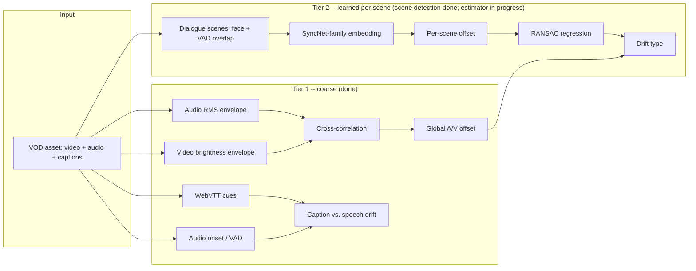

# SyncSentry

**Research-grounded A/V and caption synchronization drift detection for OTT pipelines.**

Production caption/VOD tooling checks sync with heuristics: waveform peaks
vs. frame PTS, a fixed tolerance, manual QC on outliers. That treats every
sync bug as "one global offset." Current research (DiVAS, CVPR 2024;
ModEFormer, ICASSP 2023; UniSync, 2025) shows drift actually comes in
distinct flavors -- constant, drift-early/late, intermittent -- that need
per-scene, learned detection to tell apart.

SyncSentry builds that up in stages: a benchmarked, model-free baseline
first (honest about its limits), then a learned per-scene layer on top.
See [`docs/RESEARCH.md`](docs/RESEARCH.md) for the literature and
[`docs/ROADMAP.md`](docs/ROADMAP.md) for build status.

## Architecture



Tier 1 (`analyzer/`, Python) is fully implemented and benchmarked below.
Tier 2's scene detection is real and validated; the learned estimator is
still in progress (M3c). The Go orchestrator (`services/orchestrator/`) is
scaffolded for catalog-scale batch runs (M4).

## Benchmark results

Reproducible with `syncsentry benchmark` -- synthetic, sample-accurate
ground truth, no restricted-access datasets.

**A/V offset recovery:** 0.00ms mean error across a -900ms..+900ms sweep.

| Injected (ms) | Estimated (ms) | Confidence | Direction |
|---:|---:|---:|:---|
| -500 | -500.0 | 0.828 | audio_leads |
| -30 | -30.0 | 0.925 | in_sync |
| 0 | 0.0 | 0.976 | in_sync |
| 100 | 100.0 | 0.958 | audio_lags |
| 900 | 900.0 | 0.955 | audio_lags |

*(Full sweep: [`benchmark/results/av_offset_benchmark.md`](benchmark/results/av_offset_benchmark.md).
Known limitation: periodic-signal cross-correlation is ambiguous past `±period/2` -- found via the benchmark itself, now a pinned regression test. Details in [`docs/RESEARCH.md`](docs/RESEARCH.md).)*

**Caption-vs-speech drift recovery:** exact median recovery across an
11-point sweep, checked independently of the video track. Full sweep:
[`benchmark/results/caption_drift_benchmark.md`](benchmark/results/caption_drift_benchmark.md).

## Detect + fix + report

The actual end-user surface: point SyncSentry at a video (+ optional
captions), it detects, **fixes**, re-measures the result to prove the fix
worked, and writes a short report.

```bash
syncsentry fix --video asset.mkv --captions asset.vtt --out-dir out/
```
```
A/V sync    : detected +180ms -> FIXED (residual +0.0ms)
Captions    : detected -110ms -> FIXED (residual +0.0ms)
Overall: ✅ all issues resolved
```

- **A/V fix** re-encodes just the audio track (trim/pad real samples) --
  not a metadata-only `-itsoffset` remux, which was verified to do nothing
  for consumers that read raw decoded samples ([`av_fix.py`](analyzer/syncsentry/fixer/av_fix.py)).
- **Every step re-measures the actual output** rather than composing
  corrections algebraically -- this is what caught the bugs below.
- **A confidence gate** skips fixing when the detector can't reliably tell
  if there's a real issue (common on real talking-head content -- found via
  a real bug report, see [`docs/RESEARCH.md`](docs/RESEARCH.md)), instead of
  confidently "fixing" noise.

## Title-level drift classification + dialogue-scene detection

A robust (RANSAC) fit across per-window offsets classifies *why* a title is
out of sync (`in_sync` / `constant_offset` / `drift_increasing` /
`drift_decreasing` / `intermittent`) -- DiVAS's (CVPR 2024) core idea.

```bash
syncsentry classify-drift --video asset.mkv
syncsentry dialogue-scenes --video interview.mkv   # real face + real speech overlap
```

The per-window estimator is still Tier-1 signal processing (learned
estimator = M3c). On real talking-head footage that estimator can pass its
own confidence gate on spurious correlations -- validated against a real CC
BY 3.0 clip and documented in [`docs/RESEARCH.md`](docs/RESEARCH.md), which
is exactly why `dialogue-scenes` (real face detection + real VAD,
independently validated) exists as the trustworthy half of this milestone.

## HTTP API

```bash
uvicorn syncsentry.api:app --port 8000
curl -F "video=@asset.mkv" -F "captions=@asset.vtt" http://localhost:8000/v1/fix
curl -F "video=@asset.mkv" http://localhost:8000/v1/classify-drift
curl -F "video=@asset.mkv" http://localhost:8000/v1/dialogue-scenes
```

Thin by design: every endpoint calls the same `pipeline`/`lipsync` code the
CLI and tests use.

## Quickstart

```bash
cd analyzer
python3.11 -m venv .venv && source .venv/bin/activate
pip install -r requirements-core.txt -r requirements-api.txt -r requirements-ml.txt
pip install -e .

syncsentry gen-fixture --out fixtures/demo.mkv --offset-ms 150 --captions
syncsentry fix --video fixtures/demo.mkv --captions fixtures/demo.vtt --out-dir out/
syncsentry benchmark --out-dir ../benchmark/results

pytest tests/ -v   # 56 cases (4 real-content ones auto-skip without step below)

# Optional: validate face detection + VAD against a real CC-licensed clip
bash scripts/fetch_real_content.sh && pytest tests/test_dialogue_scenes_real.py -v
```

## Tech stack

Python 3.11 (NumPy/SciPy/OpenCV for signal + face detection) · Silero VAD ·
PyTorch (Apple Silicon MPS) · Go (orchestrator) · FFmpeg.

## Repo layout

```
analyzer/            Python package: detectors, fixers, lipsync, API, CLI, tests
  syncsentry/
    synth/            Ground-truth fixture generator
    detectors/        Coarse A/V offset detector (cross-correlation)
    captions/         Caption-vs-speech drift checker
    fixer/            Applies A/V + caption corrections
    lipsync/          Windowed offsets, RANSAC drift classification,
                      real face detection (YuNet) + VAD (Silero) + dialogue scenes
    pipeline.py       Detect -> fix -> re-measure orchestration
    api.py            FastAPI HTTP service
  fixtures/real_content/  Real-content test fixture (gitignored; see SOURCES.md)
  scripts/            Dev tooling (fetch_real_content.sh)
  tests/
benchmark/results/    Generated benchmark tables + charts (committed)
services/orchestrator/  Go orchestration/API service (in progress)
docs/RESEARCH.md     Literature -> design-decision mapping
docs/ROADMAP.md      Milestone status
```

## Background

Built by [Arjun T](mailto:arjun.thekkethil11@gmail.com), extending
production caption-sync and frame-accurate VOD/iVOD tooling experience from
Fox Corporation's OTT Media Systems team into current A/V-sync research.
