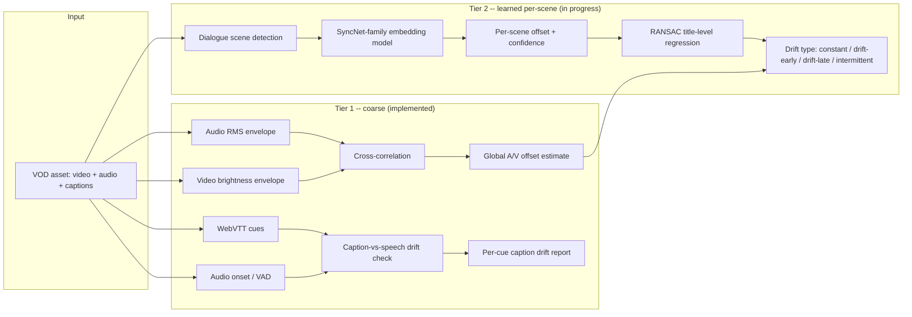
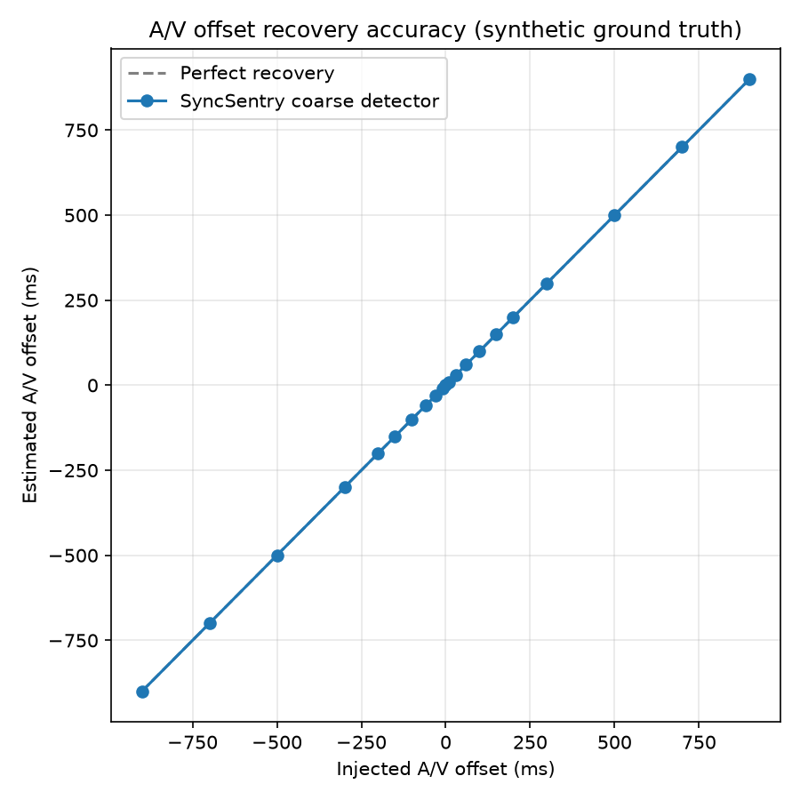

# SyncSentry

**Research-grounded A/V and caption synchronization drift detection for OTT pipelines.**

Production caption/VOD tooling at most streaming companies (including the
tooling this project's author built and shipped at Fox for vertical-caption
sync and frame-accurate VOD/iVOD cutting) checks synchronization with
heuristics: waveform peaks vs. frame PTS, a fixed tolerance, manual QC on
outliers. That's fast and explainable, but it treats every sync problem as
"one global offset," when the current research literature (DiVAS, CVPR 2024;
ModEFormer, ICASSP 2023; UniSync, 2025) shows sync drift actually comes in
several distinct, differently-remediated flavors: constant offset,
progressive drift-early/late, and intermittent offset -- and that catching
them reliably requires per-scene, learned detection, not just a single
title-level number.

SyncSentry is an from-scratch, benchmarked implementation of that idea,
built up in stages: a rigorous, model-free baseline first (with an honest
accounting of its limitations), then a learned per-scene layer on top of it.
See [`docs/RESEARCH.md`](docs/RESEARCH.md) for the literature this is built
on and exactly which design decision each paper drove, and
[`docs/ROADMAP.md`](docs/ROADMAP.md) for build status.

## Why this problem

A/V and caption sync bugs are one of the most common, most visible quality
defects in OTT delivery -- and one of the hardest to catch at catalog scale,
because "global offset" heuristics can't tell "this whole title is 80ms out"
apart from "this title drifts progressively worse from minute 40 onward."
Those are different bugs with different root causes (mux error vs. VFR
timeline drift) and different fixes. This project's design goal is a
detection stack that can tell them apart automatically, at catalog scale,
with results that are validated against synthetic ground truth rather than
eyeballed.

## Architecture



**Tier 1** (`analyzer/`, Python) is fully implemented and benchmarked below.
**Tier 2** and the Go orchestration/API service (`services/orchestrator/`)
are in progress -- see [`docs/ROADMAP.md`](docs/ROADMAP.md).

## Benchmark results

All results below are reproducible with `syncsentry benchmark` -- no
restricted-access datasets required. Methodology: inject a known offset into
synthetic, sample-accurate ground-truth fixtures (`syncsentry/synth/fixture_gen.py`)
and measure recovery error, the same evaluation approach used by DiVAS/SyncNet
in the literature (see [`docs/RESEARCH.md`](docs/RESEARCH.md)).

### Global A/V offset recovery (coarse cross-correlation detector)



| Injected (ms) | Estimated (ms) | Error (ms) | Confidence | Direction |
|---:|---:|---:|---:|:---|
| -900 | -900.0 | 0.0 | 0.827 | audio_leads |
| -500 | -500.0 | 0.0 | 0.828 | audio_leads |
| -200 | -200.0 | 0.0 | 0.829 | audio_leads |
| -100 | -100.0 | 0.0 | 0.829 | audio_leads |
| -30 | -30.0 | 0.0 | 0.925 | in_sync |
| 0 | 0.0 | 0.0 | 0.976 | in_sync |
| 30 | 30.0 | 0.0 | 0.959 | in_sync |
| 100 | 100.0 | 0.0 | 0.958 | audio_lags |
| 200 | 200.0 | 0.0 | 0.958 | audio_lags |
| 500 | 500.0 | 0.0 | 0.957 | audio_lags |
| 900 | 900.0 | 0.0 | 0.955 | audio_lags |

*(Full 21-point sweep in [`benchmark/results/av_offset_benchmark.md`](benchmark/results/av_offset_benchmark.md).)*

**Known limitation:** periodic-signal cross-correlation is only unambiguous
up to `± period/2` -- this was discovered *by the benchmark itself* (a
-500ms injection aliased to +500ms on a 1-second-period fixture) and is now
a pinned regression test
(`tests/test_coarse_detector.py::test_periodic_ambiguity_boundary_is_documented`)
rather than a silent gap. Details in [`docs/RESEARCH.md`](docs/RESEARCH.md#3-coarse-model-free-detection-is-a-legitimate-first-tier-with-a-known-limitation).

### Caption-vs-speech drift recovery

| Injected caption offset (ms) | Recovered median (ms) | Matched cues | Flagged cues |
|---:|---:|---:|---:|
| -300 | -300.0 | 10 | 9 |
| -80 | -80.0 | 10 | 8 |
| -30 | -30.0 | 10 | 0 |
| 0 | 0.0 | 10 | 0 |
| 30 | 30.0 | 10 | 0 |
| 80 | 80.0 | 10 | 9 |
| 300 | 300.0 | 10 | 10 |

*(Full sweep in [`benchmark/results/caption_drift_benchmark.md`](benchmark/results/caption_drift_benchmark.md).
Caption drift is checked against detected audio onsets directly, independent
of the video track -- see [`docs/RESEARCH.md`](docs/RESEARCH.md#4-caption-drift-is-a-distinct-problem-from-pictureaudio-drift)
for why that's a deliberate, distinct check from the A/V offset detector.)*

## Quickstart

```bash
cd analyzer
python3.11 -m venv .venv && source .venv/bin/activate
pip install -r requirements-core.txt && pip install -e .

# Generate a synthetic fixture with a known 150ms A/V offset + matching captions
syncsentry gen-fixture --out fixtures/demo.mkv --offset-ms 150 --captions

# Detect it
syncsentry detect-offset --video fixtures/demo.mkv
syncsentry check-captions --video fixtures/demo.mkv --captions fixtures/demo.vtt

# Reproduce the full benchmark suite + charts
syncsentry benchmark --out-dir ../benchmark/results

# Run the test suite (18 cases, offset-recovery + edge cases)
pytest tests/ -v
```

## Tech stack

- **Python 3.11** (signal processing, detectors, benchmark harness) --
  NumPy/SciPy for envelope cross-correlation, OpenCV for frame-level video
  analysis, soundfile for sample-accurate audio synthesis, pytest for
  recovery-accuracy testing.
- **PyTorch (Apple Silicon MPS backend)** -- Tier 2 learned per-scene model
  (in progress).
- **Go** -- orchestration/API service, catalog batch runner (in progress).
- **FFmpeg** -- media I/O, synthetic fixture rendering.

## Repo layout

```
analyzer/            Python package (syncsentry): detectors, synth fixtures, CLI, tests
  syncsentry/
    synth/            Ground-truth fixture generator
    detectors/        Coarse A/V offset detector (cross-correlation)
    captions/         Caption-vs-speech drift checker
    lipsync/          Tier 2 learned per-scene model (in progress)
    report/           Benchmark harness (markdown + chart generation)
    util/             ffmpeg/ffprobe/OpenCV wrappers
  tests/              Recovery-accuracy pytest suite
benchmark/results/    Generated benchmark tables + charts (reproducible, committed)
services/orchestrator/  Go orchestration/API service (in progress)
docs/
  RESEARCH.md         Literature review, paper -> design-decision mapping
  ROADMAP.md          Milestone status and rationale
```

## Background

Built by [Arjun T](mailto:arjun.thekkethil11@gmail.com), extending production
caption-sync and frame-accurate VOD/iVOD tooling experience from Fox
Corporation's OTT Media Systems team into the current A/V-sync research
literature. See [`docs/RESEARCH.md`](docs/RESEARCH.md) for details.
